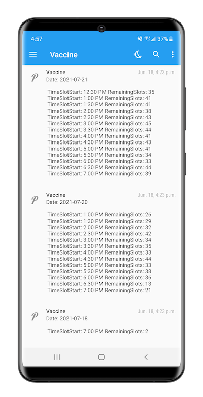

# covid-19-vaccine-appointment


The script will check for next 7days of Embassy Grand Appointments(https://embassygrand.mdnius.com/) and notify is there is any available slots over Push Over Notification on Mobile (Android/iOS)

To generate an Application Token: https://pushover.net/apps/build and replace <REPLACE_API_TOKEN> in main.py

To Get User Key, check this URL: https://pushover.net/#apps and replace <REPLACE_USER_KEY> in main.py




You can add it as a cronjob to schedule it for every 5minutes.

Instructions:

```
#pip install -r requirements.txt
```

```
#python main.py
```
